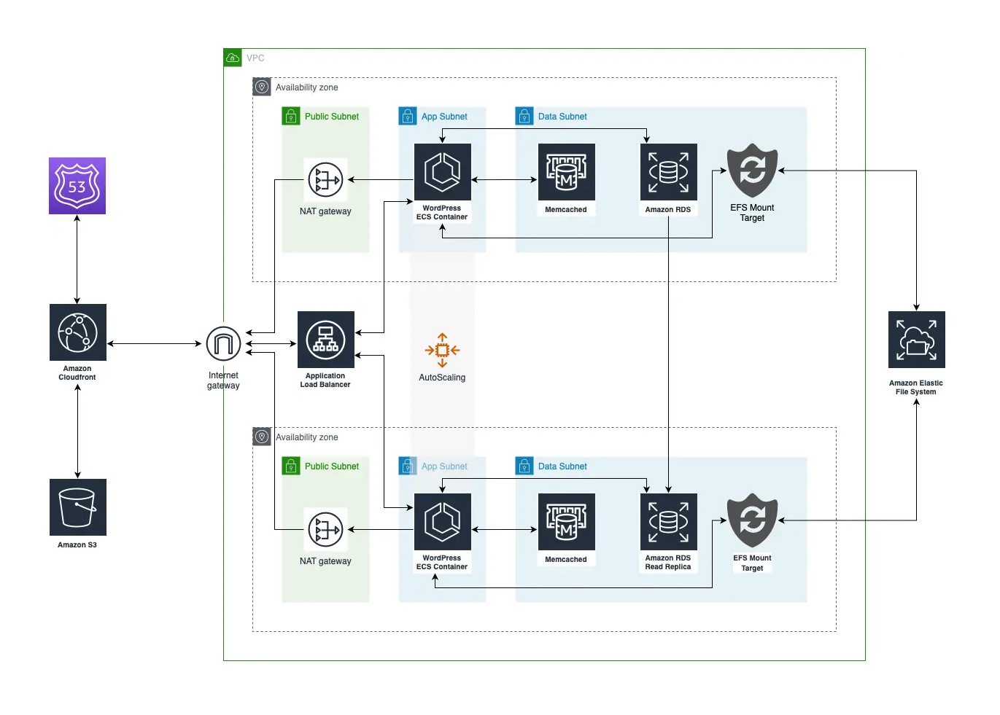

# Deploy a WordPress site to AWS

This project deploys a WordPress site to your AWS account using GitHub Actions & some variables that you set.

## Prerequisites

- An AWS account
- A domain name

## Setup

- Clone this repo
- Install [invoke](http://www.pyinvoke.org/)
- Run `invoke setup` to setup your virtual environment & install the dependencies

## Usage

- Run `invoke list` to list the available tasks
- Run `invoke test` to run the tests
- Run `invoke build` to build the project
- Run `invoke deploy` to deploy the project
- Run `invoke destroy` to destroy the project
